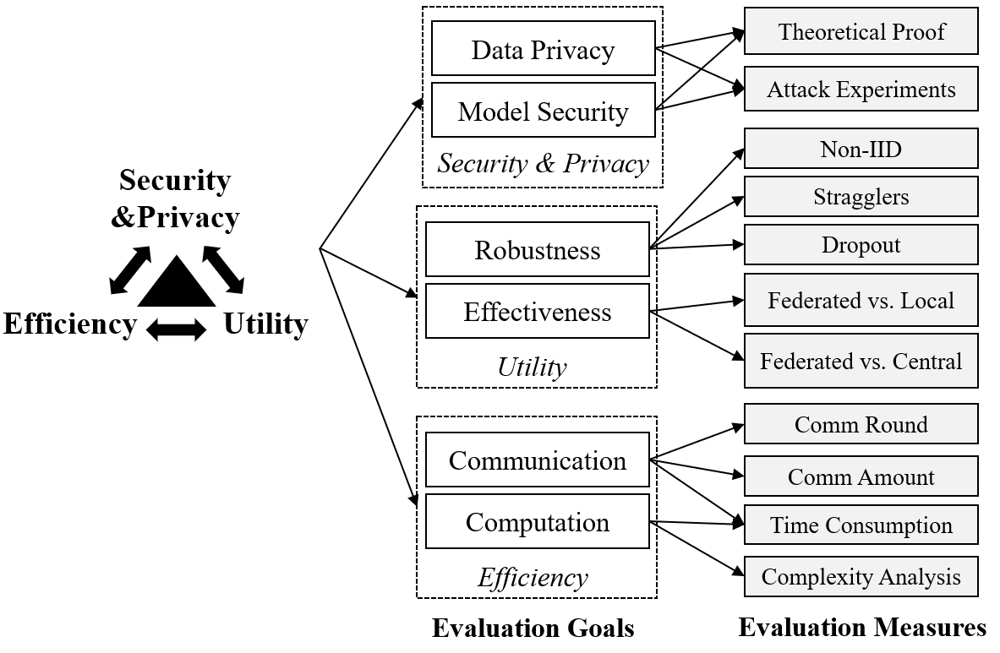

## Introduction

#### The Evaluation Goals and Measures

Based on the investigation of existing works, we summarize the evaluation goals of federated learning (FL) into utility, efficiency, and security \& privacy. For each of the goals, we summarize the detailed measurements, which form the basis of FedEval (i.e., our evaluation platform). The detailed introduction of the evaluation goals and measures could be found in our survey paper.([Arxiv](https://arxiv.org/abs/2308.11841)/[IEEE](https://ieeexplore.ieee.org/abstract/document/10480259)).

#### The Evaluation Framework

We propose a federated benchmarking system called FedEval shown in the above figure, which demonstrates the inputs, inner architecture, and outputs of the system. To use FedEval, users only need to provide a single script that contains the necessary FL functions or callback functions, such as how the server aggregates the parameters from different clients, to evaluate a new FL algorithm or test new attack/defense methods. The platform consists of three key modules.

-  **Data Config and the `FedData` module**: FedEval currently provides seven standard FL datasets, including MNIST, CIFAR10, CIFAR100, FEMNIST, CelebA, Sentiment140, and Shakespeare. Different data settings (e.g., non-IID data) can be implemented by changing the data configs. Self-defined data is also supported. We only need to inherit the `FedData` class and define the `load_data` function to add a new dataset, which will share the same processing functions with the built-in datasets.
- **Model Config and the `Keras.Model` module**: Currently, three machine learning models are built inside our system, including `MLP`, `LeNet`, and `StackedLSTM`. We use TensorFlow as the backend, and all the models are made via subclassing the Keras model. Thus, adding new machine learning models is very simple in FedEval.
- **Runtime Config and the `strategy` module**: One of the essential components in FedEval is the `strategy` module, which defines the protocol of the federated training. Briefly, the FL strategy module supports the following customization:
   - **Customized uploading message**, i.e., which parameters are uploaded to the server from the clients.
   - **Customized server aggregation method**, e.g., weighted average.
   - **Customized training method for clients**, e.g., the clients' model can be trained using regular gradient descent method or other solutions like knowledge distillation.
   - **Customized **methods** for incorporating** the global and local model**, e.g., one popularly used method is replacing the local model with the global one before training.

We use the docker container technology to simulate the server and clients (i.e., each participant is a container), and use socket IO in the communication. The isolation between different containers guarantees that our simulation can reflect the real-world application. The entire system is open-sourced, with seven benchmark FL datasets, including MNIST, CIFAR10, CIFAR100, FEMNIST, CelebA, Sentiment140, and Shakespeare. The essential components (i.e., dataset, ML models, and FL strategy) can be easily used or self-defined. Thus researchers can implement their new idea and evaluate using FedEval very quickly.

Briefly, three steps are needed to start an experiment in our benchmarking system:

-  **Step 1**: Determine the benchmark dataset, ML model, and FL strategy, then modify the data, model, and runtime configs based on the templates.

-  **Step 2**: Use the built-in tool to generate data for clients and create the docker-compose files.

-  **Step 3**: Start the experiments using docker-compose, and monitor the dashboard for the evaluation status and results.
