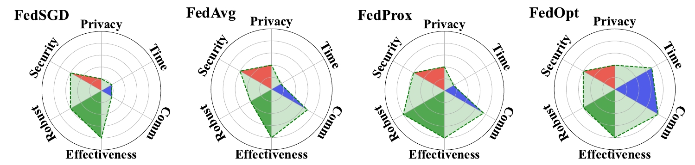

## Benchmarks

### An investigation of evaluation metrics used in existing work

**(Y: Well evaluated; P: Partially evaluated;)**

|    Area    |                                                             Representative  Work                                                             |          Venue          |     Type     |              Privacy               | Non-IID Feature | Non-IID Label | Hetero Sys | Comm Round | Comm Amount | Time | Effectiveness |
|:----------:|:--------------------------------------------------------------------------------------------------------------------------------------------:|:-----------------------:|:------------:|:----------------------------------:|:--------------:|:------------:|:---------:|:---------:|:----------:|:----:|:-------------:|
|   Top AI   |                                        Distributed Backdoor Attacks  Against Federated Learning                                         |        ICLR  20         |   Attacks    |               |                |              |           |           |            |      |               |
|   Top AI   |                                             Fair Resource Allocation  in Federated Learning                                             |        ICLR  20         | FL Algorithm |                                    |       Y        |              |           |     Y     |            |      |       P       |
|   Top AI   |                                  Personalized Federated Learning  with First Order Model Optimization                                   |        ICLR  21         | FL Algorithm |                                    |       Y        |      Y       |           |     Y     |            |      |       P       |
|   Top AI   |            Personalized Federated Learning  with Theoretical Guarantees:  A Model-Agnostic Meta-Learning  Approach            |        NIPS  20         | FL Algorithm |                                    |                |      Y       |           |           |            |      |       P       |
|   Top AI   |                                         Personalized Federated Learning  with Moreau Envelopes                                          |        NIPS  20         | FL Algorithm |                                    |                |      Y       |           |     Y     |            |      |       P       |
|   Top AI   |                                                Federated Adversarial Domain  Adaptation                                                 |        ICLR  20         | FL Algorithm |                                    |       Y        |              |           |           |            |      |       P       |
|   Top AI   |                                               Federated Learning with  Matched Averaging                                                |        ICLR  20         | FL Algorithm |                                    |                |      Y       |           |     Y     |     Y      |      |       P       |
|   Top AI   |                 Achieving  Linear Speedup  with Partial Worker  Participation in Non-IID  Federated  Learning                 |        ICLR  20         | FL Algorithm |                                    |                |      Y       |           |     Y     |     Y      |  Y   |       P       |
|   Top AI   |                                                       Adaptive  Federated Optimization                                                       |        ICLR  21         | FL Algorithm |                                    |                |              |           |     Y     |            |      |       P       |
|   Top AI   |                             FedBE:  Making Bayesian  Model Ensemble Applicable  to Federated Learning                              |        ICLR  21         | FL Algorithm |                                    |                |      Y       |           |           |            |      |       P       |
|   Top AI   |                           FedBN:  Federated Learning  on Non-IID Features  via Local Batch Normalization                           |        ICLR  21         | FL Algorithm |                                    |       Y        |              |           |     Y     |            |      |       P       |
|   Top AI   |                                          Federated  learning based  on Dynamic Regularization                                           |        ICLR  21         | FL Algorithm |                                    |                |      Y       |           |           |     Y      |      |               |
|   Top AI   |                   Federated  Learning via  Posterior Averaging:  A New Perspective and  Practical Algorithm                   |        ICLR  21         | FL Algorithm |                                    |                |              |           |     Y     |            |      |       P       |
|   Top AI   |                      Federated  Semi-supervised  Learning with Inter-Client  Consistency & Disjoint  Learning                      |        ICLR  21         | FL Algorithm |                                    |                |      Y       |           |     Y     |            |      |       P       |
|   Top AI   |                             FedMix:  Approximation of  Mixup under Mean Augmented  Federated learning                              |        ICLR  21         | FL Algorithm |                 P                  |       Y        |      Y       |           |     Y     |            |      |       Y       |
|   Top AI   |                 HeteroFL:  Computation and  Communication Efficient Federated  learning For Heterogeneous Clients                  |        ICLR  21         | FL Algorithm |                                    |       Y        |      Y       |           |           |            |      |       P       |
|   Top AI   |                                              R-GAP:  Recursive Gradient  Attack on Privacy                                              |        ICLR  21         |   Attacks    |                 Y                  |                |              |           |           |            |      |               |
|   Top AI   |                                                         Agnostic  Federated Learning                                                         |        ICML  19         | FL Algorithm |                                    |                |              |           |           |            |      |       P       |
|   Top AI   |                                       Analyzing  Federated Learning  through an Adversarial Lens                                        |        ICML  19         |   Defense    |                 Y                  |                |              |           |           |            |      |               |
|   Top AI   |                                     Bayesian  Nonparametric Federated  Learning of Neural Networks                                      |        ICML  19         | FL Algorithm |                                    |                |      Y       |           |     Y     |            |      |               |
|   Top AI   |                      Acceleration  for Compressed  Gradient Decent in Distributed  and Federated Optimization                      |        ICML  20         | FL Algorithm |                                    |                |              |           |           |     Y      |      |       P       |
|   Top AI   |                                 FedBoost:  Communication-Efficient  Algorithms for Federatred Learning                                  |        ICML  20         | FL Algorithm |                                    |                |              |           |     Y     |            |      |       P       |
|   Top AI   |                                             Federated  Learning with  Only Positive Lables                                              |        ICML  20         | FL Algorithm |                                    |                |              |           |           |            |      |       Y       |
|   Top AI   |                                       Communication-Efficient  Federated  Learning with Sketching                                       |        ICML  20         | FL Algorithm |                                    |                |              |           |           |            |      |       P       |
|   Top AI   |                                    SCAFFOLD:  Stochastic Controlled  Averging for Federated Learning                                    |        ICML  20         | FL Algorithm |                                    |       Y        |              |           |     Y     |            |      |       P       |
|   Top AI   |                               From  Local SGD  to Local Fixed-Point  Methods for Federated Learning                                |        ICML  20         | FL Algorithm |                                    |                |              |           |     Y     |            |  Y   |       P       |
|   Top AI   |                            Bias-Variance  Reduced  Local SGD for Less  Heterogeneous Federated Learning                            |        ICML  21         | FL Algorithm |                                    |                |      Y       |           |           |            |      |       P       |
|   Top AI   |       Clustered  Sampling: Low-Variance  and Improved Respresentativity  for Clients Selection   in Federated Learning        |        ICML  21         | FL Algorithm |                                    |                |              |           |     Y     |            |      |       P       |
|   Top AI   |                              CRFL:  Certifiably Robust  Federated Learning  against Backdoor Attacks                               |        ICML  21         |   Defense    |                 Y                  |                |              |           |           |            |      |               |
|   Top AI   |                              Debiasing  Model Updates  for improving Personalied  Federated Learning                               |        ICML  21         | FL Algorithm |                                    |                |      Y       |           |     Y     |            |      |               |
|   Top AI   |                The  distributd discrete  gaussian mechanism for  federated learning with  secure  aggregation                 |        ICML  21         | FL Algorithm |                 Y                  |       Y        |      Y       |           |     Y     |            |      |       P       |
|   Top AI   |                                          Personalized  federated learning  using hypernetworks                                          |        ICML  21         | FL Algorithm |                                    |       Y        |      Y       |           |           |            |      |       P       |
|   Top AI   |                                       Heterogeneity  for the Win:  One-shot Federated Clustering                                        |        ICML  21         | FL Algorithm |                                    |                |      Y       |           |     Y     |            |      |       P       |
|   Top AI   |   Gradient  disaggregation:  breaking privacy in  federated learning by  reconstructing the  user  participant matrix    |        ICML  21         |   Attacks    |                                    |                |              |           |           |            |      |               |
|   Top AI   |                         FL-NTK:  A neural tangent  Kernal-based framework  for federated learning analysis                         |        ICML  21         | FL Algorithm |                                    |                |      Y       |           |     Y     |            |      |               |
|   Top AI   |             Federated  Deep Auc  maximization for heterogeneous  data with a constant  communication  complexity              |        ICML  21         | FL Algorithm |                                    |                |      Y       |           |     Y     |            |      |       P       |
|   Top AI   |                                  Exploiting  Shared Reprentations  for Personalized Federted Learning                                   |        ICML  21         | FL Algorithm |                                    |                |      Y       |           |     Y     |            |      |       P       |
|   Top AI   |                           Federated  Doubly Stochastic  Kernal Learning for  Vertically Partitioned Data                           |         KDD  20         | FL Algorithm |                 Y                  |                |              |           |           |            |  Y   |       P       |
|   Top AI   |                                                        Federated  Multi-Task Learning                                                        |        NIPS  17         | FL Algorithm |                                    |       Y        |              |     Y     |           |            |  Y   |       Y       |
|   Top AI   |                               FedSplit:  An Algorithmic  Framework for Fast  Federated Optimization                                |        NIPS  20         | FL Algorithm |                                    |                |              |           |     Y     |            |      |       P       |
|   Top AI   |                              Throughput-Optimal  Topology  Design for Corss-silo  Federated Learning                               |        NIPS  20         | FL Algorithm |                                    |                |              |     Y     |     Y     |            |  Y   |               |
|   Top AI   |                   Tackling  the Objective  incensistency Problem  in Heterogeneous  Federated optimization                    |        NIPS  20         | FL Algorithm |                                    |                |      Y       |           |     Y     |            |      |       P       |
|   Top AI   |                                Robust  Federated Learning:  The Case of Affine  Distribution Shifts                                |        NIPS  20         | FL Algorithm |                                    |                |      Y       |           |           |            |      |       P       |
|   Top AI   |                             Lower  Bounds and Optimal  Algorithms for Personalized  Federated Learning                             |        NIPS  20         | FL Algorithm |                                    |                |              |           |     Y     |            |      |       P       |
|   Top AI   |                           Inverting  Gradients  - How easy is it to break  privacy in federated learning                           |        NIPS  20         |   Attacks    |                 Y                  |                |              |           |           |            |      |               |
|   Top AI   |                             Group  Knowledge Transfer:  Federated Learning of  Large CNNs at the Edge                              |        NIPS  20         | FL Algorithm |                                    |                |      Y       |           |     Y     |     Y      |  Y   |       P       |
|   Top AI   |                                                Federated  Principle Component  Analysis                                                 |        NIPS  20         | FL Algorithm |                 Y                  |                |              |           |           |            |  Y   |       P       |
|   Top AI   |                                         Federated  Bayesian Optimization  via Thompson Sampling                                         |        NIPS  20         | FL Algorithm |                                    |       Y        |              |           |           |            |  Y   |               |
|   Top AI   |                                           Federated  Accelerated Stochastic  Gradient Descent                                           |        NIPS  20         | FL Algorithm |                                    |                |              |           |     P     |            |      |               |
|   Top AI   |                                        An  Efficient Framework for  Clustered Federated Learning                                        |        NIPS  20         | FL Algorithm |                                    |       Y        |              |           |           |            |      |       Y       |
|   Top AI   |                              Attack  of the Tails:  Yes, You Really Can  Backdoor Federated Learning                               |        NIPS  20         |   Attacks    |                                    |                |              |           |           |            |      |               |
|   Top AI   |                                           Differentially-Private   Federatred Linear Bandits                                            |        NIPS  20         | FL Algorithm |                 Y                  |                |              |           |     P     |            |      |       P       |
|   Top AI   |                                              Distributionally  Robust  Federated Averaging                                              |        NIPS  20         | FL Algorithm |                                    |                |      Y       |           |     Y     |            |  Y   |       P       |
|   Top AI   |                               Ensemble  Distillation for  Robust Model Fusion  in Federated Learning                               |        NIPS  20         | FL Algorithm |                                    |                |      Y       |           |     Y     |            |      |       P       |
| Top System |                Billion-Scale  Federated  Learning on Mobile Clients:  A Submodel Design  with Tunable Privacy                 |       MobiCom  20       | FL Algorithm |                 Y                  |       Y        |              |     Y     |     Y     |            |      |       P       |
| Top System |                               Oort:  Efficient Federated  Learning via Guided  Participant Selection                               |         OSDI 20         | FL Algorithm |                                    |       Y        |              |     Y     |     Y     |            |  Y   |       P       |
| Top Crypto |                              Local  Model Poisoning  Attacks to Byzantine-Robust  Federated Learning                               | Usenix Security 20 |   Attacks    |                                    |                |              |           |           |            |      |               |
| Top Crypto |                                    Poseidon:  Privacy-preserving  Federated Neural Network Learning                                     |        NDSS  21         | FL Algorithm |                 Y                  |                |      Y       |           |     Y     |            |  Y   |       Y       |
| Top Crypto |            Manipulating  the Byzantine:  Optimizing Model Poisoning  Attacks and Defenses  for Federated  Learning            |        NDSS  21         | Attacks  & Defenses |                 Y                  |                |              |           |           |            |      |               |
| Top Crypto |                              FLTrust:  Byzantine-robust  Federated Learning via  Trust Bootstrapping                               |        NDSS  21         |   Defense    |                 Y                  |                |              |           |           |            |      |               |
| Top Crypto |                              Practical  Secure Aggregation  for Privacy-preserving Machine  Learning                               |         CCS  17         | FL Algorithm |                 Y                  |                |              |     Y     |           |     Y      |  Y   |               |

### Radar Chart

**Privacy score (qualitative):**

- Score {math}`0` if directly exchanging raw data.
- Score {math}`1` if the exchanged parameters are in plaintext and calculated from a single round of training.
- Score {math}`2` if the exchanged parameters are in plaintext and calculated from multiple rounds of training.
- Score {math}`3` if the exchanged parameters are protected by DP or the parameters are compressed.
- Score {math}`4` if the exchanged parameters are protected by secure aggregation.
- Score {math}`5` if the exchanged parameters are protected by homomorphic encryption.

**Robustness score (quantitative):**

- Add {math}`3` points if the non-IID performance disparity to IID model {math}`\le 1\%`.
- Add {math}`2` points if the non-IID performance disparity to IID model {math}`\le 3\%`.
- Add {math}`1` points if the non-IID performance disparity to IID model {math}`\le 5\%`.
- Add {math}`1` point if the stragglers are handled.
- Add {math}`1` point if the dropouts are handled.

**Efficiency score (quantitative):** The efficiency score is the calculated through averaging the quantitative score of three sub-metrics, which are the communication rounds, communication amount, and the time consumption. For each of these sub-metrics, we choose one baseline model (i.e., FedSGD), score 1 point to the baseline model, and then compute the score of other methods through comparing to the baseline model. Specifically:

- If the method A's performance {math}`P_a` (e.g., time consumption) is worse than the baseline model {math}`P_b`, then we give score {math}`e^{1-P_b/P_a}` to A.
- Otherwise, if method A's performance {math}`P_a` is better than the baseline model {math}`P_b`, denoting the best performance as {math}`\bar{P}`, then we give score {math}`1 + 4(P_b - P_a)/(P_b - \bar{P})` to A. We set the best performance {math}`\bar{P}=0` for time consumption, {math}`\bar{P}=1` for communication rounds, and {math}`\bar{P}=0` for communication amount.

**Effectiveness score (quantitative):**

- If the model's performance is better than local model, we score according to the performance disparity to central model. Score {math}`5 \sim 1` if performance disparity to central model is {math}`\le 1\%`, {math}`\le 3\%`, {math}`\le 5\%`, {math}`\le 10\%`, and {math}`\le 20\%`, respectively.
- Score {math}`0` if the performance is worse or equal to local model.

### Parameter Tuning

TBD.

