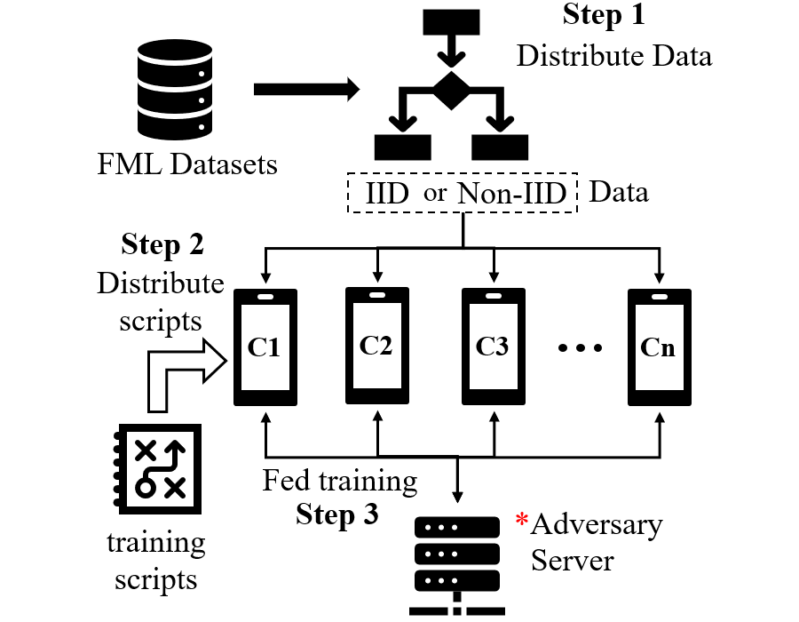
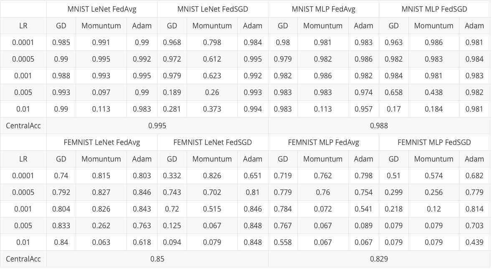
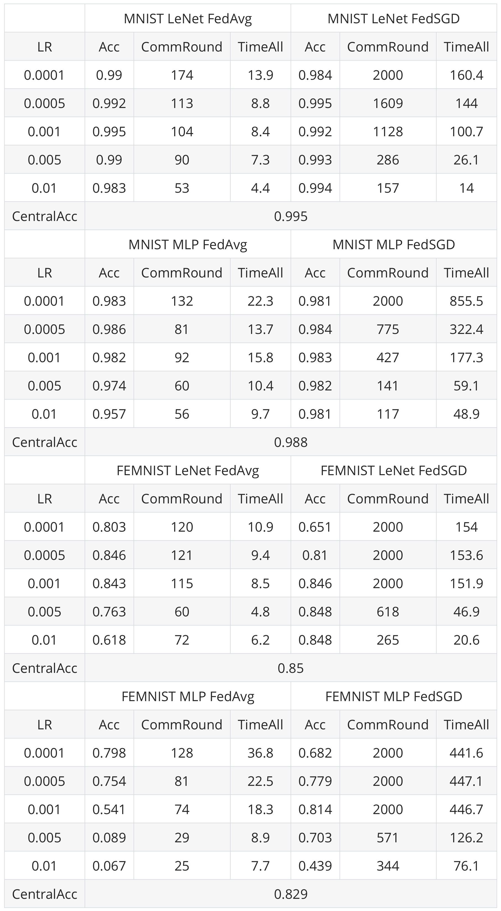

Appendix 1 The Benchmarking System
========================================

   The framework of the benchmarking system

Having motivated the need for an easy-to-use and lightweight benchmarking system, we propose a federated benchmarking system shown in this figure. The system contains the following three steps:

- **Step 1:** Distribute the data to all clients, where different strategies can be applied to generate IID or non-IID data.
- **Step 2:** Provide the training scripts and distribute the codes to all the clients.
- **Step 3:** Training the model. The ACTPR evaluation model will run automatically in this step. 

We used the docker container technology to simulate the server and clients. The isolation between different containers guarantees that our simulation can reflect the real-world application. All the benchmark system is open-sourced, and four benchmark FL datasets are included in the system. Thus researches can implement their new idea and evaluate with ACTPR model very quickly.

Appendix 2 Datasets and Hardware
========================================

Four datasets are used in the experiments: `MNIST <http://yann.lecun.com/exdb/mnist>`_, `CIFAR-10 <https://www.cs.toronto.edu/~kriz/cifar.html>`_, `FEMNIST <https://github.com/TalwalkarLab/leaf#datasets>`_, `CelebA <https://github.com/TalwalkarLab/leaf#datasets>`_. We perform the classification task on all datasets. FEMNIST is an extended MNIST dataset based on handwritten digits and characters. CelebA builds on the Large-scale CelebFaces Attributes Dataset, and we use the *smiling* label as the classification target. For the non-IID evaluation, we use different strategies. In MNIST and CIFAR-10, we simulate non-IID by restricting the number of clients' local image classes. Experiments of each client has 1,2​ and 3 classes are reported. In FEMNIST and CelebA, we have the identity of who generates the data. Thus we partition the data naturally based on the identity, and perform a random shuffle for IID setting.

On average, each client holds 300 images on MNIST and CIFAR-10 datasets, 137 images on the FEMNIST dataset, and 24 images on the CelebA dataset. At each client, we randomly select 80\%, 10\%, and 10\% for training, validation, and testing. 

All the experiments run on a cluster of three machines. One machine with Intel(R) Xeon(R) E5-2620 32-core 2.10GHz CPU, 378GB RAM, and two machines with Intel(R) Xeon(R) E5-2630 24-core 2.6GHz CPU, 63GB RAM. We put the server on the first machine and 40, 30, 30 clients on three machines, respectively. 

Appendix 3 Tuning Optimizer and LR
=================================================

Results of tuning the optimizers
---------------------------------

The following table show the results of FL accuracy when we vary the learning rate (lr) and optimizers. The experiments are performed on MNIST and FEMNIST datasets, using MLP and LeNet model, FedSGD and FedAvg FL schemas. Among these three optimizers, **Adam can achieve the best accuracy more frequently, and Adam is more robust given different lr.

Results of tuning the learning rate (LR)
------------------------------------------

Appendix 4 Grid Search on FedAvg
=================================================

.. toctree::
   :maxdepth: 1

   fedavg_grid_search.md