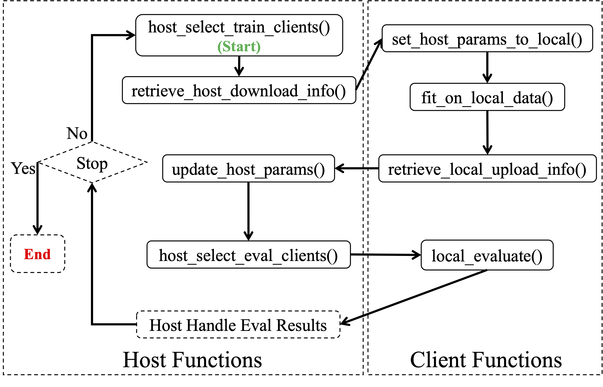

## Interface of FL Algorithms

Our interface of FL algorithm provides the following functions for customizing the host's behaviors:

- **update\_host\_params**: It takes clients' uploaded parameters as input, then update and return the host model weights. The default aggregation method is weighted average, and the users could override this function to provide different aggregation methods.
- **retrieve\_host\_download\_info**: It returns the message that the clients download. By default, it returns the host's model weight, and the users could override this function to customize the data that clients download from the server.
- **host\_select\_train\_clients**: It takes all the ready clients' identity (CID) as input, then return the CIDs that will participate in the next round of training. By default, it randomly chooses clients according the parameters (\ie, the ratio of participation), and the users could override this function to change the client selection strategy.
- **host\_select\_eval\_clients**: It takes all the ready clients' identity (CID) as input, then return the CIDs that will participate in the next round of evaluation. Similar with **host\_select\_train\_clients**, it randomly chooses clients according the parameters by default.
- **host\_exit\_job**: This function will be executed by the host when the federated training finished. By default it does nothing.

Our interface of FL algorithm provides the following functions for customizing the clients' behaviors:

- **set\_host\_params\_to\_local**: It takes the data downloaded from the host as input, then update the client's local parameters. By default, it directly set the global parameters into local model, and the users could override this function to customize the approach of setting global parameters to local model.
- **fit\_on\_local\_data**: This function is executed by the clients to update the local parameters using local data. By default, it runs stochastic gradients descent (SGD) using a group of configurable training parameters (e.g., batch size and learning rate) and users could override this function to provide other training methods.
- **retrieve\_local\_upload\_info**: It returns the data that the clients will upload to the host. By default, it returns the local model parameters and users could override this function to customize the clients' uploaded data, e.g., uploading compressed gradients.
- **local\_evaluate**: This function is executed by the clients to evaluate on local models and return the evaluation results (e.g., accuracy and loss on test data) to the server for making decisions on whether the federated training has converged. The users could override this function to customize the evaluation targets.
- **client\_exit\_job**: This function is executed by the clients after the federated training finished. By default, it does nothing and the users could override this function to customize behaviors of the clients after the training, e.g., fine tune the model on local datasets to get better personalization and perform another round of evaluation.

The following figure shows the serialized workow of the host's and clients' functions. The users could implement new FL algorithm through overriding one or multiple of these functions.

## Interface of Callback Functions

Besides the function for implementing new FL algorithms, we also provide interface of callback functions to make the implementation of attacks and defenses easier. Briefly, we have the following callback functions:

- **on\_client\_train\_begin**: The clients' data and model parameters pass through this function before training. Users could override this function to perform data poisoning and model poisoning before the training. 
- **on\_client\_upload\_begin**: The clients' uploading parameters pass through this function after the training. Users could override this function to perform model poisoning attack after the training.
- **on\_host\_aggregation\_begin**: The group of clients' uploaded parameters pass through this function before the aggregation. Users could override this function to perform gradients attacks, inference attacks, and defend the data/model poisoning attacks at the host side, e.g., byzantine-robust aggregation.
- **on\_setting\_host\_to\_local**: The downloaded parameters from the host passes through this function before the client updates the parameters to local model. Users could override this function to defend the data/model poisoning attacks at the client size.
- **on\_host\_exit**: The host's model weights pass through this function after the training finishes. Users could override this function to perform model inversion attacks.
- **on\_client\_exit**: The client's model weights and local data pass through this function after the training finishes. Users could override this function to perform model inversion attacks.

Based on these delicately designed interfaces, users could easily implement and evaluate attacks and defenses in FL, including the model/data poisoning attacks and defenses, inference attacks, gradients attacks, and model inversion attacks.
