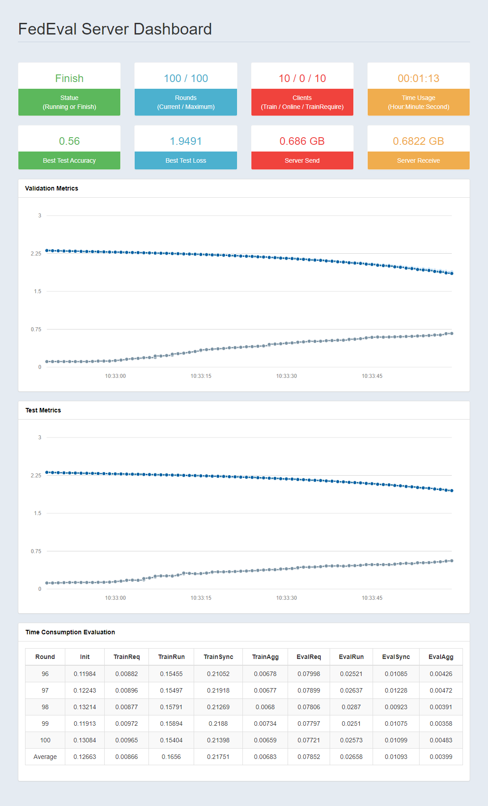

### Quick Start (single experiment using terminal)

In this page, we will show how to start an experiment locally using the config fils in QucikStart dir. Please clone the project from Github, open a terminal from the project path and follow the next tutorial.

#### Generate the data and docker-compose file

Generate the data for all the clients

```bash
docker run -it --rm -v $(pwd):$(pwd) -w $(pwd) fedeval:v1 python -W ignore -m FedEval.run -c configs/quickstart -f data
```

Generate the docker-compose file

```bash
docker run -it --rm -v $(pwd):$(pwd) -w $(pwd) fedeval:v1 python -W ignore -m FedEval.run -c configs/quickstart -f compose-local
```

#### Start the Experiment

```bash
docker-compose up -d
```

#### View the results

Go to http://127.0.0.1:port/dashboard to see the results. Please change the port according to your config. More detail about the config could be found in [Configs](Configs.html#runtime-config).

Here's an example of the [dashboard](#dashboard-example).

#### Stop the Experiment

Stop and remove the containers using docker-compose (suggested)

```bash
docker-compose stop
docker-compose rm
```

Force stop and remove all the containers

```bash
docker stop $(docker ps --filter ancestor=fedeval:v1 -aq)
docker rm $(docker ps --filter ancestor=fedeval:v1 -aq)
```

#### Dashboard Example

   

--------------------------------------